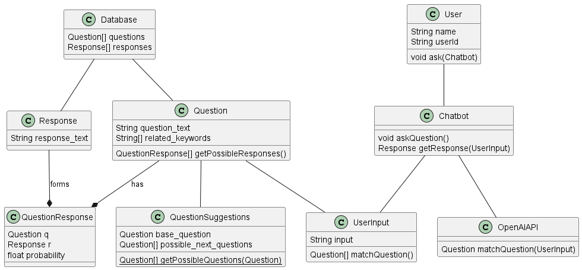
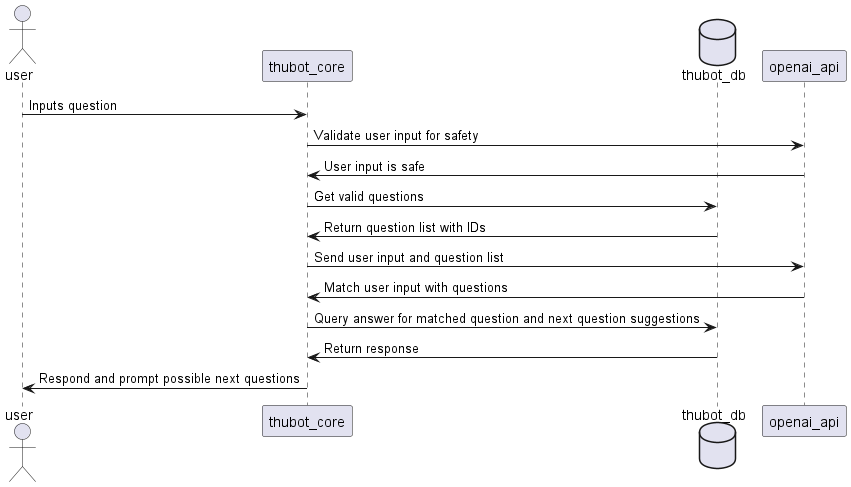

# THU BOT Software Project (CTS5)

So far, there is only a backend API implemented using Spring Boot.

## Main architecture

There are two key concepts important for the Bot:
- Question
- User Input

The Bot stores question / response pairs using predefined questions about different topics in *Question* objects and associate them with *Response* objects using the *QuestionResponse* entity.
User inputs are first validated, and then transformed into a valid Question entity.

## Requirements

Technology Stack (so far):

- Java 17
- Spring Boot with the following gradle dependencies:
- - spring-boot-starter-data-jpa
- - spring-boot-starter-web
- - mysql-connector-j
- MySQL Server

## Running the backend

Use `maven` in order to build the project. The root directory has a `pom.xml` file which has the necessary configuration in order to build the app along with its dependencies.
Open the terminal and run `mvn spring-boot:run`

### IntelIJ Idea

 There should be built in support for everything out of the box. Just open the repository and there should be a pop-up asking to run the gradle build.

### VSCode

Install the `Extenstion Pack for Java` extension pack in VS Code. This will bring all the necessary tools.
Afterward, reload VS Code and open the repository. There should be a pop-up asking if the project should use `maven` or `gradle`. Choose `maven`. The build should be running in the background, and you can check its status by clicking th icon in the bottom right corner. (look up `vscode maven integration` for more info and debugging)

Before running the code, you have to adjust the configuration in the `application.properties` file inside `src/main/resources`. Copy the file `application.properties.example` to `application.properties` and change the DB connection settings and OpenAPI API key.

**NEVER PUSH THIS FILE TO GIT! It is in the .gitignore, and it should stay that way. Do not modify the example file, otherwise credentials WILL get leaked and your OpenAI account WILL be terminated.**

This assumes you are running a MySQL server on localhost port 3306 (default for MySQL) and you have a db called THUBOT_DB and a user DB_USERNAME with DB_PASSWORD that has access to that database. 
The easiest option is to download MySQL Server for Win, Mac or Linux and run the installer. It will have a GUI configurator that is easy to use.

## PlantUML and Diagrams

Useful docs for PlantUML (Use case diagram for requirements specification): https://plantuml.com/use-case-diagram